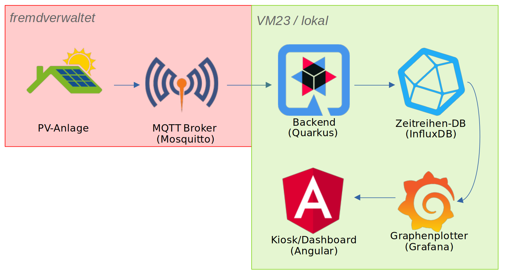
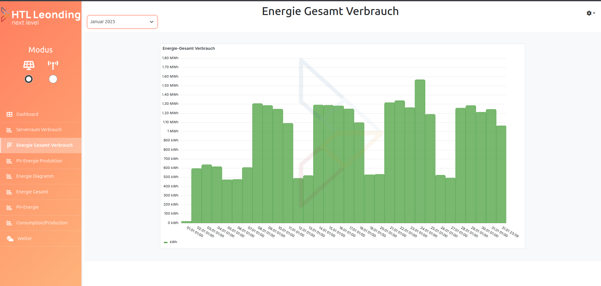
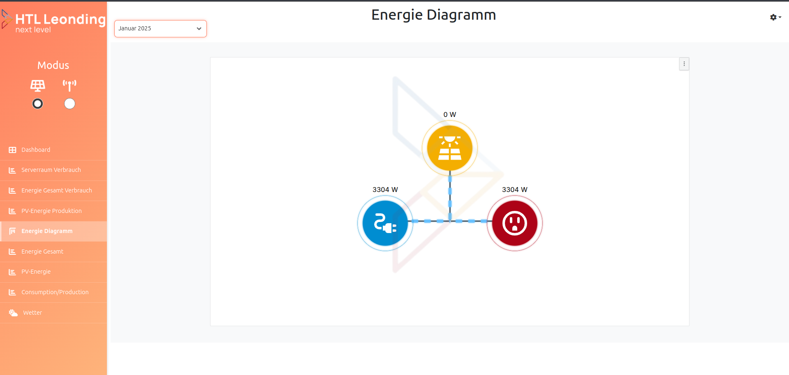
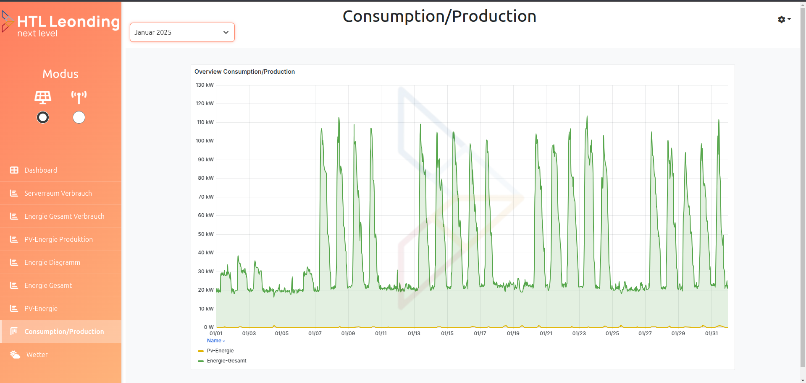
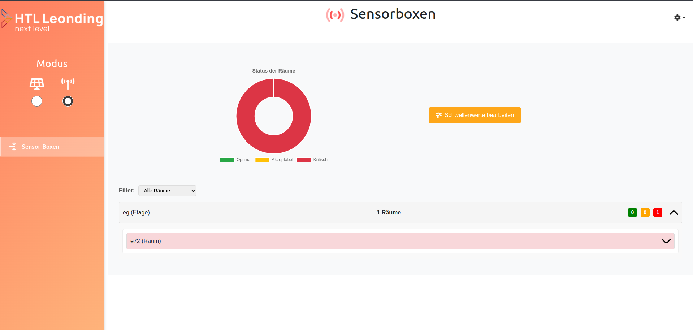

= 🔋 LeoEnergy – Dashboard zur Überwachung des Energieverbrauchs an der HTL Leonding

== 📌 Überblick
**LeoEnergy** ist ein Dashboard zur Echtzeitüberwachung und Analyse
des Energieverbrauchs an der **HTL Leonding**.
Es erfasst den Stromverbrauch und die -erzeugung
und bietet sowohl aktuelle Daten als auch historische Analysen.
Ziel ist es, Transparenz über den Energiehaushalt der Schule zu
schaffen und nachhaltige Entscheidungen zu unterstützen.

== ✨ Features
* ✅ *Echtzeitüberwachung* – Anzeige von aktuellem Stromverbrauch und -erzeugung
* ✅ *Historische Analysen* – Langfristige Trends und Muster erkennen bis 2024 Dezember
* ✅ *Interaktive Visualisierung* – Grafische Darstellung der Energieflüsse
* ✅ *Effizienzsteigerung* – Identifikation von Einsparpotenzialen
* ✅ *Benutzerfreundliches UI* – Einfache und intuitive Bedienung

== 👀 Live-Demo
Das Projekt kann unter folgendem Link angesehen werden:
🌍 link:https://vm23.htl-leonding.ac.at/[LeoEnergy]

== 🛠️ Technologie-Stack

== 🚀 Installation & Setup
=== Voraussetzungen
- Docker

=== Installation
[source,sh]
----
# Repository klonen
git clone https://github.com/2324-4bhif-syp/2324-4bhif-syp-project-iot-dashboard
----
=== Starten der Anwendung
[source,sh]
----
# Docker-Compose starten
docker compose -f 2324-4bhif-syp-project-iot-dashboard/compose/docker-compose.yaml up

# Entwicklungsmodus (DEV)
# dev.yaml starten
docker compose -f /home/balint/htl/4bhif/syp/2324-4bhif-syp-project-iot-dashboard/compose/dev.yaml up

# Backend im Entwicklungsmodus starten
cd backend/leoenergy
./mvnw quarkus dev
----

== 📷 Screenshots

== 🏗️ Überblick über das ganze Projekt
image::documentation/deployment/files/deployment.png[]

== 📜 Lizenz
Dieses Projekt steht unter der link:https://www.htl-leonding.at/[**HTL-Leonding**].

== 👥 Mitwirkende
- **[Balint Balazs]** – https://github.com/balintb4
- **[Said Nurceski]** – https://github.com/sxidn
- **[Erik Seifried]** – https://github.com/erikseifried
- **[Markus Breinesberger]** – https://github.com/markSuuS
