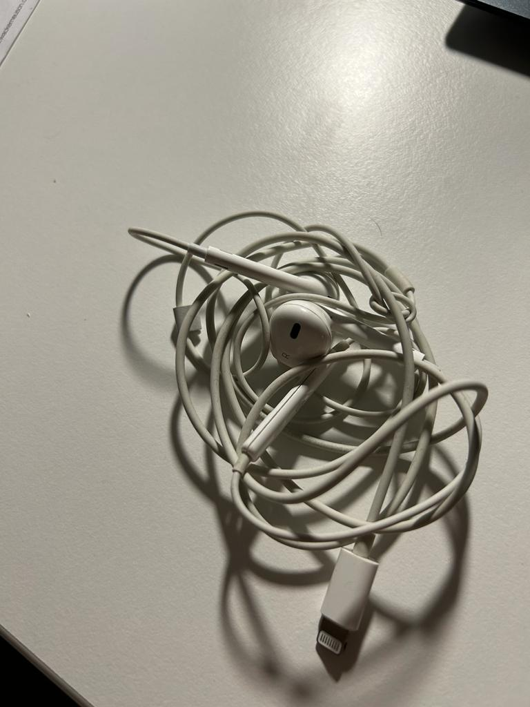
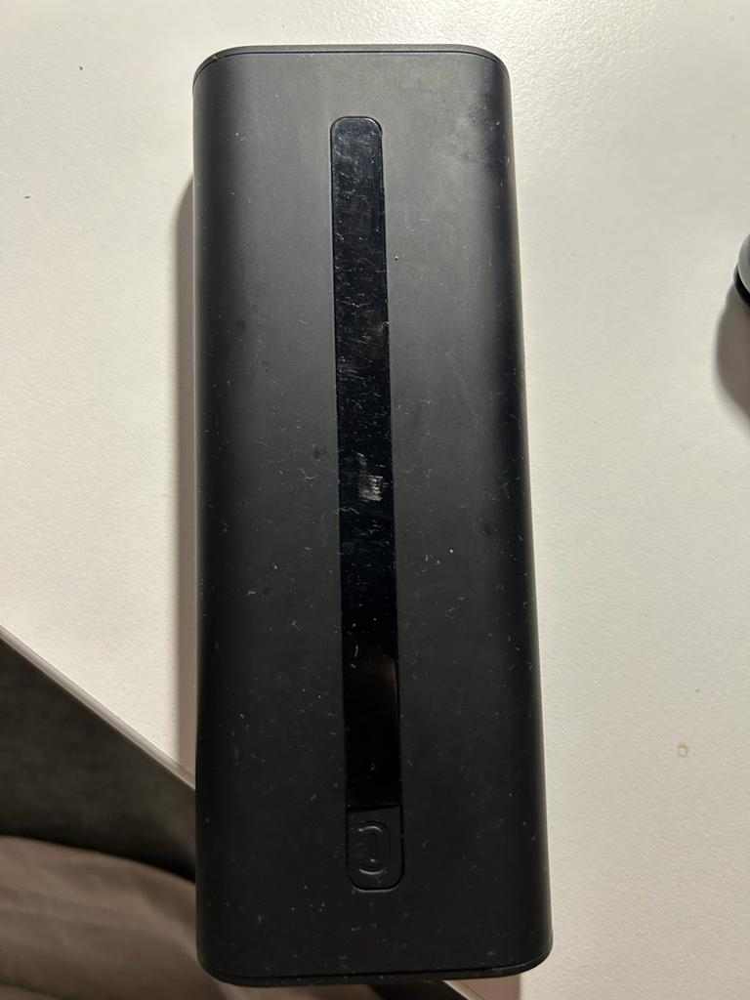
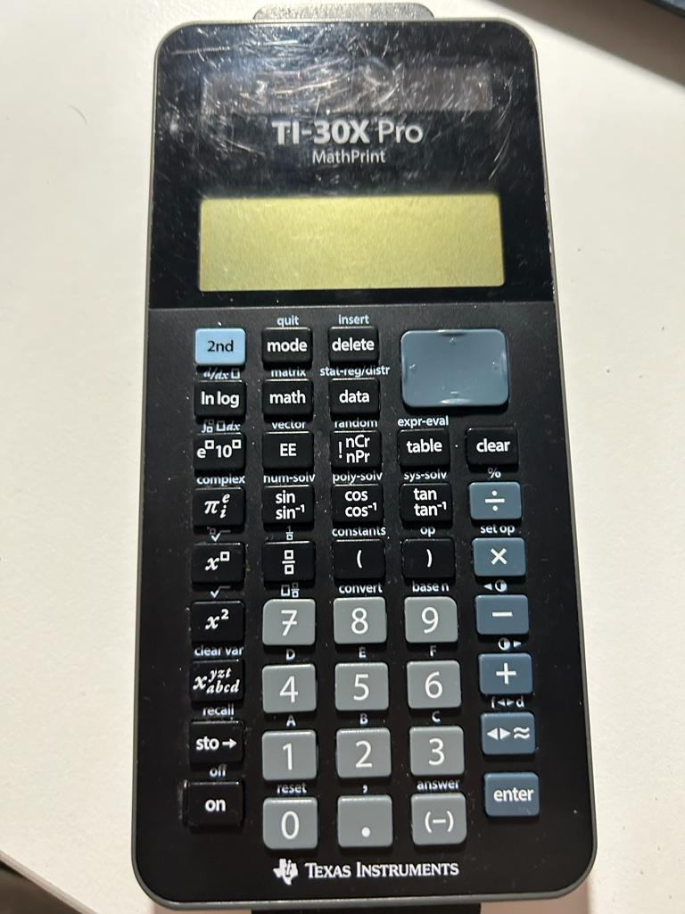

== Response from the API

== 1. Picture

=== Response:
[source,json]
----
{
    "code": 200,
    "status": 20000,
    "result": [
        {
            "id": "BVzMIaoJ9TRLJUdS9ftx",
            "image": "https://storage.googleapis.com/causal-diffusion.appspot.com/imagePrompts%2F0c7a6c28-5aef-482a-9afc-3d8f45e1b816%2Foriginal.png",
            "algorithm": "Aqua",
            "features": [
                "question_answer"
            ],
            "question": "What material is this object made of in 1 word",
            "uid": "hPJqHW5ArDed8Ohtba3YLNIhWvj2",
            "optOut": false,
            "__developer_options": null,
            "text": "The object is made of white cord.",
            "i18n": {
                "en": "The object is made of white cord."
            },
            "userId": "hPJqHW5ArDed8Ohtba3YLNIhWvj2",
            "createdAt": 1699200893025,
            "languages": [],
            "answer": "The object is made of white cord."
        }
    ]
}
----
=== 2. Picture

=== Response:
[source,json]
----
{
    "code": 200,
    "status": 20000,
    "result": [
        {
            "id": "YcV0Geb9Vp4uExblSNZ9",
            "image": "https://storage.googleapis.com/causal-diffusion.appspot.com/imagePrompts%2Fa92fa880-b0ec-400e-b13f-15e67d0dce94%2Foriginal.png",
            "algorithm": "Aqua",
            "features": [
                "question_answer"
            ],
            "question": "What material is this object made of in 1 word",
            "uid": "hPJqHW5ArDed8Ohtba3YLNIhWvj2",
            "optOut": false,
            "__developer_options": null,
            "text": "The object on the table is made of black material.",
            "i18n": {
                "en": "The object on the table is made of black material."
            },
            "userId": "hPJqHW5ArDed8Ohtba3YLNIhWvj2",
            "createdAt": 1699202177621,
            "languages": [],
            "answer": "The object on the table is made of black material."
        }
    ]
}
----

== 3.Picture

=== Response

[source,json]
----
{
    "code": 200,
    "status": 20000,
    "result": [
        {
            "id": "PRWhQ4MDiRAkKYLKWzWD",
            "image": "https://storage.googleapis.com/causal-diffusion.appspot.com/imagePrompts%2Fe558a4d4-ef38-4913-878a-5d7934b88d06%2Foriginal.png",
            "algorithm": "Aqua",
            "features": [
                "question_answer"
            ],
            "question": "What material is this object made of in 1 word",
            "uid": "hPJqHW5ArDed8Ohtba3YLNIhWvj2",
            "optOut": false,
            "__developer_options": null,
            "text": "The object is made of plastic.",
            "i18n": {
                "en": "The object is made of plastic."
            },
            "userId": "hPJqHW5ArDed8Ohtba3YLNIhWvj2",
            "createdAt": 1699202626799,
            "languages": [],
            "answer": "The object is made of plastic."
        }
    ]
}
----

