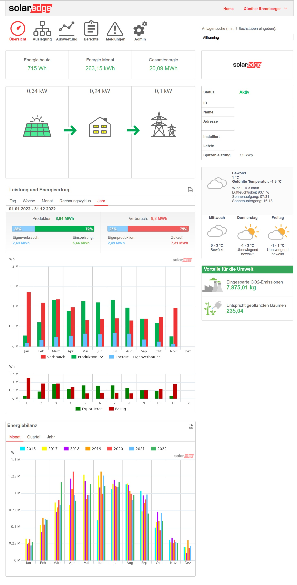
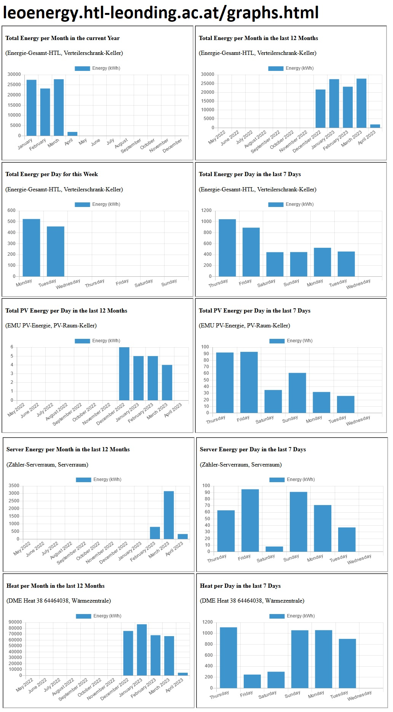

= Fragen von 07.05.2024

===  Welche und wie viele Daten wurden in welcher Form(Tags) gespeichert
* Änderungen:
* Es werden alle Werte in normaler Form gespeichert außer werden zusätzliche Metadaten von Backend hinzugefügt wie zum Beispiel: Relation
** Die Wattwerte werden in Kilowatt umgewandelt von Leoenergy und so wird es in der Influxdb gespeichert
** Mit den WH-Werten wird nichts geändert

===  Gibt es bereit ein Produktivsystem
** Ja

* Wie sehen die Diagramme aus?
** verwendete Daten: Die Daten werden von vm90 genommen
** Aussehen: Schlecht

=== Ziel des Projektes
* Dashboard für die Schule
* Dashboards sollen Aussagekräftig  und man sollte für jeden verstehbar sein
* Dynamische Anpassung bei neuen Geräten möglich
* Verlauf Analyse möglich von uns als Nachricht

=== Nächste Sprint
* Endergebniss ungefähr mit Kiosk mode

image:Beispiel_SolarEdge_PV/Energie-Monitor.jpg[]
image:Beispiel_SolarEdge_PV/pv-linie.jpg[]

