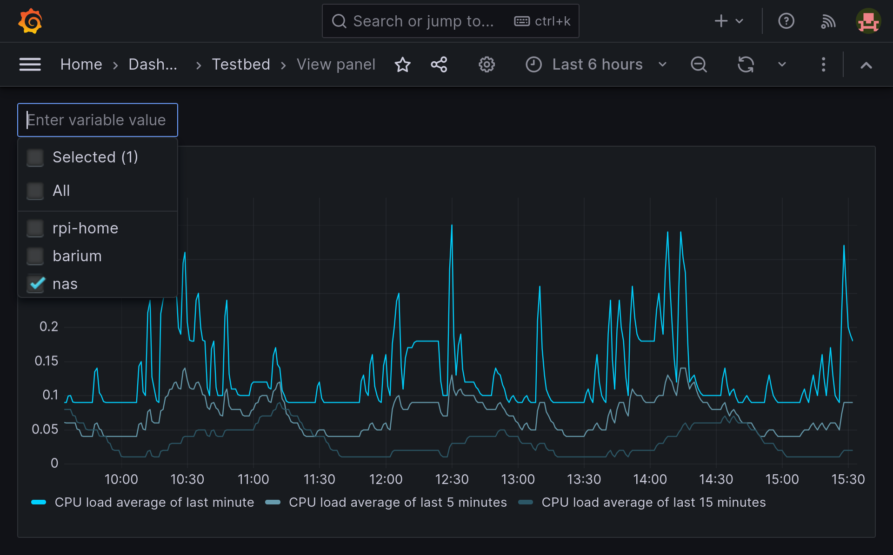
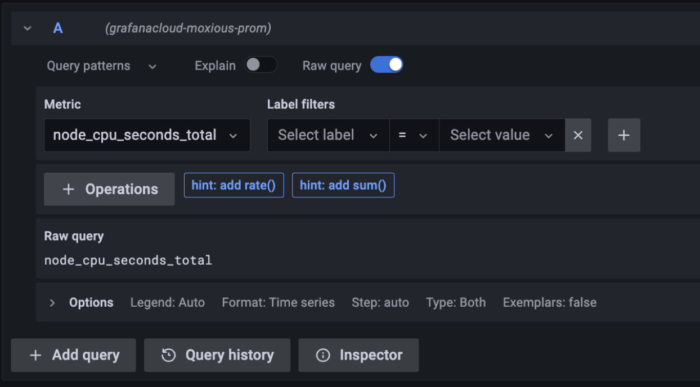
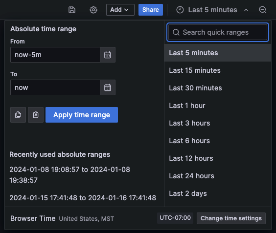

= Grafana with several graphs in one diagram

== Neues Dashboard erstellen
image::add-new-dashboard.png[]
- Einloggen und zum Dashboardbereich wechseln
- Auf "New Dashboard" klicken
- Panel hinzufügen

== Panel konfigurieren
- Visualisierungstyp graph auswählen
- Im Query-Bereich die Abfragen hinzufügen

== Mehrere Graphen hinzufügen
- Weiteren Graphen hinzufügen
- Zeitraum einstellen

== Panel-Optionen anpassen
- Hier kann man das Aussehen der Graphen anpassen
- Legende beschriften

== Schwellenwerte und Alarme
- Bei Bedarf Schwellenwerte und Alarme einstellen

== Dashboard speichern
- Dem Panel einen Titel geben und speichern