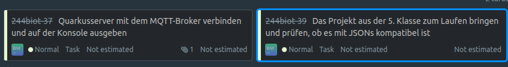
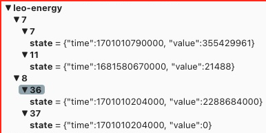
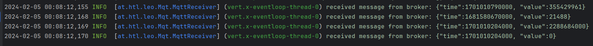

= Sprint Protokoll

`Breinesberger Markus, 4.2.2024`

== Task 1: "_Quarkusserver mit dem MQTT-Broker verbinden und auf der Konsole ausgeben_"

Ein fremdverwalteter MQTT-Broker liefert Daten mit der folgenden Syntax:

Meine Aufgabe war es, eine Verbindung damit herzustellen und die empfangenen Daten auf der Log-Konsole auszugeben.
Dafür sind folgende Schritte notwendig.

* Abhängigkeiten aktualisieren

`pom.xml`
[source, xml]
----
<dependency>
    <groupId>io.quarkus</groupId>
    <artifactId>quarkus-smallrye-reactive-messaging-mqtt</artifactId>
</dependency>
----

* Klasse zur Kapselung der empfangenen Daten erstellen
(inkl. statischer Methode zur Konvertierung eines JSON-Strings in eine Instanz und umgekehrt)

`MqttData.java`
[source, java]
----
import com.fasterxml.jackson.databind.JsonNode;
import com.fasterxml.jackson.databind.ObjectMapper;
import io.quarkus.logging.Log;

public class MqttData {
    private long time;
    private final double value;

    private MqttData(long time, double value){
        this.time = time;
        this.value = value;
    }

    // inkl. Getter & Setter für time & value

    public static MqttData convertJsonToMqttData(String jsonString){...}
    public String convertToJson(){...}
}
----

* Daten zur Verbindung mit dem Broker in application.properties setzen

`application.properties`

[source, properties]
----
mp.messaging.incoming.leo-energy.connector=smallrye-mqtt
mp.messaging.incoming.leo-energy.host=vm90.htl-leonding.ac.at
mp.messaging.incoming.leo-energy.port=1883
mp.messaging.incoming.leo-energy.topic=leo-energy/#
mp.messaging.incoming.leo-energy.username=student
mp.messaging.incoming.leo-energy.password=passme
----

* Klasse erstellen, die die empfangenen Daten behandelt

`MqttReceiver.java`

[source, java]
----
import io.quarkus.logging.Log;
import jakarta.enterprise.context.ApplicationScoped;
import org.eclipse.microprofile.reactive.messaging.Incoming;

@ApplicationScoped
public class MqttReceiver {
    @Incoming("leo-energy")
    public void receive(byte[] byteArray){
        final String msgAsJson = new String(byteArray); <1>
        Log.info("received message from broker: " + msgAsJson);
        MqttData mqttObject = MqttData.convertJsonToMqttData(msgAsJson); <2>
    }
}
----

1. Da die Daten vom Broker als Byte-Array kommen -> Konvertierung in String
2. Konvertierung des Strings in eine Instanz von MqttData

=== Ergebnis

Ausgabe der empfangenen Daten in der Log-Konsole

== Task 2: "_Das Projekt aus der 5. Klasse zum Laufen bringen und prüfen, ob es mit JSONs kompatibel ist_"

Die zweite Aufgabe war es, ein Mini-Projekt einer Informatik-Klasse des 5. Jahrgangs zu starten, schauen was
passiert eine eventuelle Nützlichkeit im Bezug zu unserem Projekt zu notieren.

=== Beobachtungen

Bei diesem Projekt werden verschiedene Daten zum Thema Luft (Luftfeuchtigkeit, CO2-Gehalt,...) von ebenso
fremdverwaltetem einem MQTT-Broker empfangen. und in einer JSON-Datei gespeichert.

Beispiel: `eg-e58_2-co2-1706918357.json`

[source, json]
----
{"floor":"eg","room":"e58_2","type":"co2","timestamp":1706918357,"value":403.33}
----

=== Erkenntnisse
Da es sich dabei um Werte zur Luft handelt und gar nichts mit dem Thema Energieverbrauch oder Photovoltaik generell
zu tun hat, ist dieses Projekt für unser Projekt LeoEnergy leider nicht nutzbar.